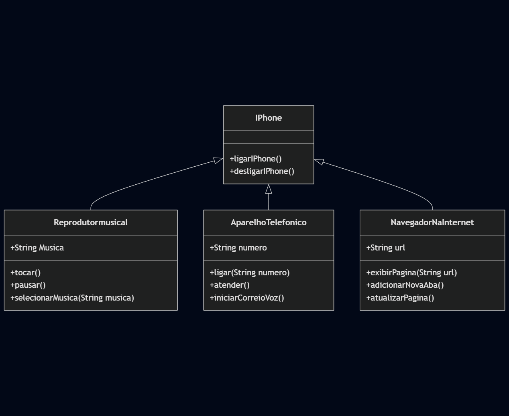

Este é um projeto de modelagem UML que tem como objetivo representar, por meio de diagrama de classes, o componente iPhone, abrangendo suas principais funcionalidades: Reprodutor Musical, Aparelho Telefônico e Navegador na Internet.

